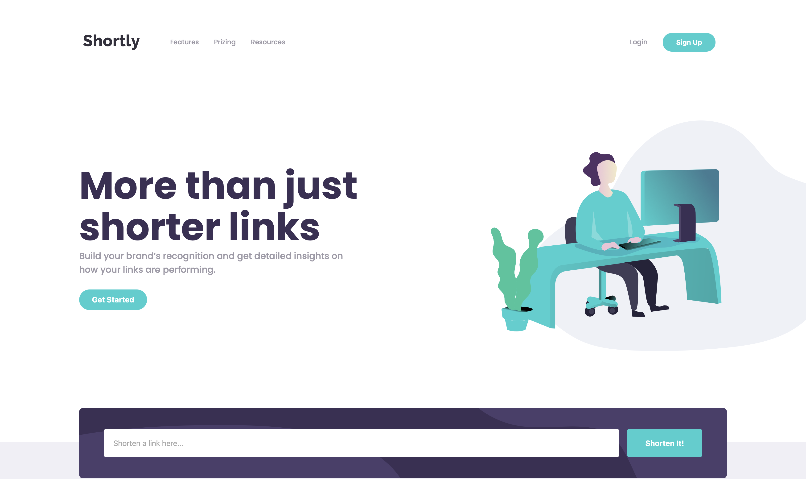
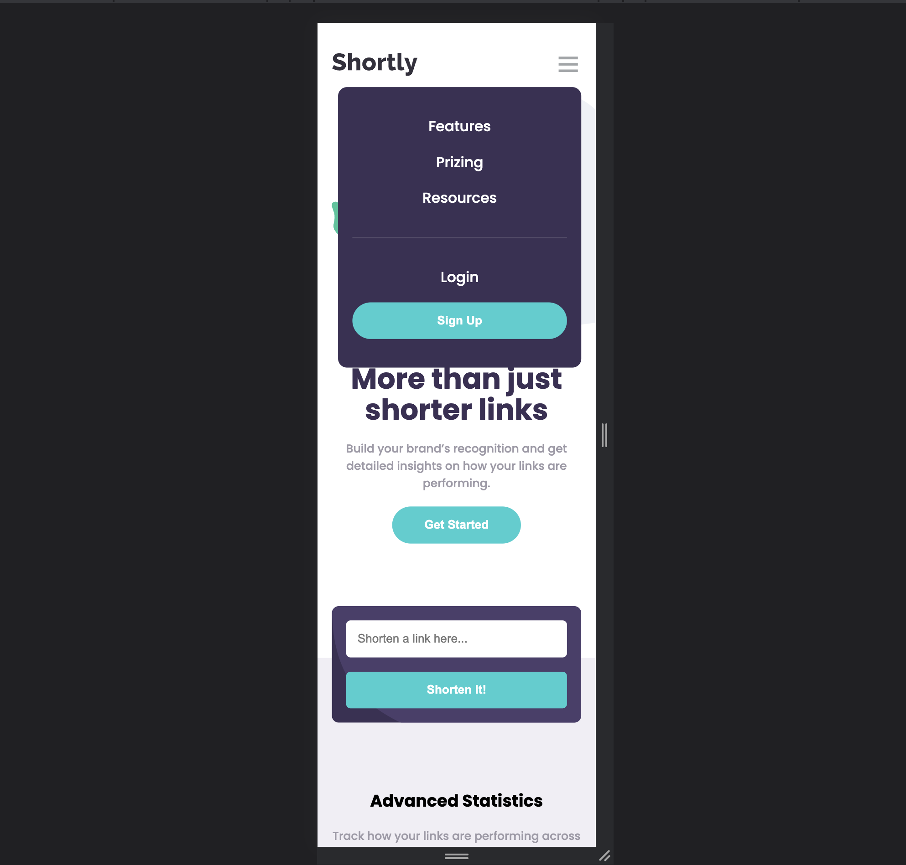

# Frontend Mentor - Shortly URL shortening API Challenge solution

This is a solution to the [Shortly URL shortening API Challenge challenge on Frontend Mentor](https://www.frontendmentor.io/challenges/url-shortening-api-landing-page-2ce3ob-G). Frontend Mentor challenges help you improve your coding skills by building realistic projects. 

## Table of contents

- [Overview](#overview)
  - [The challenge](#the-challenge)
  - [Screenshot](#screenshot)
  - [Links](#links)
- [My process](#my-process)
  - [Built with](#built-with)
  - [What I learned](#what-i-learned)
  - [Continued development](#continued-development)
  - [Useful resources](#useful-resources)
- [Author](#author)
- [Acknowledgments](#acknowledgments)

## Overview

### The challenge

Users should be able to:

- View the optimal layout for the site depending on their device's screen size
- Shorten any valid URL
- See a list of their shortened links, even after refreshing the browser
- Copy the shortened link to their clipboard in a single click
- Receive an error message when the `form` is submitted if:
  - The `input` field is empty

### Screenshot




### Links

- [solution URL](https://github.com/Rataash99/Shortly-URL-Shortening_challenge_frontend_mentor)
- [live site URL](https://astounding-sunshine-79eee8.netlify.app)

## My process

### Built with

- Semantic HTML5 markup
- CSS custom properties
- Flexbox
- Mobile-first workflow
- API
- LocalStorage

### What I learned

I haven't used localStorage for a long time so this project helped me out remembering concepts of local storage and helped me understanding API's. 

code snippets, see below:

```html
<div class="home">
          <div class="home-left">
            <h1 class="hl-tagline">More than just shorter links</h1>
            <p class="hl-para">
              Build your brand’s recognition and get detailed insights on how
              your links are performing.
            </p>
            <button class="hl-btn btn">Get Started</button>
          </div>
          <div class="hr-img">
            
          </div>
        </div>
```
```css
.btn2{
    border-radius: 5px;
    border: none;
    padding: 0.8rem;
    font-weight: bolder;
    color: white;
    background: hsl(180, 66%, 49%);
    transition-duration: 0.5s;
}
.btn2:hover{
    background: hsl(180, 53%, 73%);
    cursor:pointer;
}
```
```js
const fetchData = () => fetch(`https://api.shrtco.de/v2/shorten?url=${url}`)
.then(res => res.json())
.then((result) => {
    localStorage.getItem('links');
    let ans = result.result.short_link2;
    let li = document.createElement('li');
    li.innerHTML = 
    `<p class = "url">${url}</p>
    <hr class = 'li-hr'>
    <div class = 'li-right-div'>
    <p class = "short-url">https://www.${ans}</p>
    <button onclick = "copyText('${ans}')"  class = 'copy btn3'>Copy</button>
    </div>`;
    listData.append(li);
    localStorage.setItem('links', listData.innerHTML);
})
```

### Continued development

Planning to build some projects using tailwind / bootstrap and REACT

### Useful resources

- [Freecodecamp](https://forum.freecodecamp.org/t/how-to-store-dynamically-generated-list-items-in-localstorage-individually-so-each-with-their-own-key/299602) - This article helped in implementation of local storage.
- [FontAwesome](https://fontawesome.com/) - If you want to use any icons in your project this is the goto place. I do recommend it, do check out.

## Author

- Linkedin - [Rohit Singh] - (https://www.linkedin.com/in/rohit-s-03a577137/)
- Frontend Mentor - [@Rataash99](https://www.frontendmentor.io/profile/Rataash99)
- Showcase - [@rataash99](https://www.showwcase.com/rataash99)

## Acknowledgments

I am really glad to join the frontend mentor community and I would like to thank all the members to provide us with such amazing projects and all members of the community to helping us out by any means whether it's an article to videos, hats off to all people (^_^)> .
